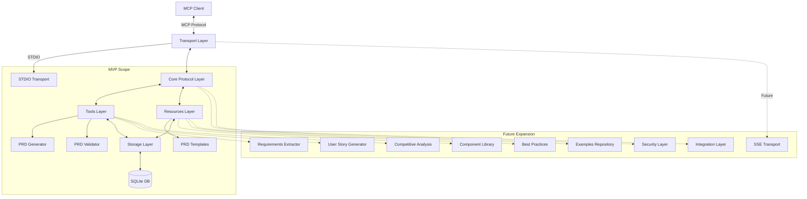
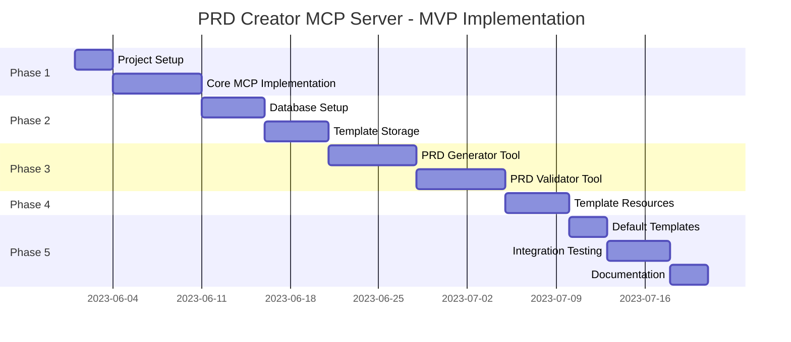

# PRD Creator MCP Server Implementation Plan

## 1. Overview and MVP Architecture

An implementation plan with an MVP-first approach, using a free database solution.



## 2. MVP Scope Definition

The MVP will focus on the core functionality needed to demonstrate the value of the PRD Creator:

### Included in MVP:
1. **Core MCP Protocol Implementation**
   - STDIO transport only
   - Basic request/response handling
   - Error management

2. **Essential Tools**
   - PRD Generator (template-based)
   - PRD Validator (basic validation rules)

3. **Core Resources**
   - PRD Templates (3-5 starter templates)
   - URI-based resource access

4. **Lightweight Storage**
   - SQLite database for persistence
   - Basic caching

### Post-MVP Expansion:
1. Additional tools (Requirements Extractor, User Story Generator, etc.)
2. More resources (Component Library, Best Practices, Examples)
3. Advanced features (SSE transport, security, external integrations)

## 3. Technology Stack Selection

### Core Technologies (MVP)
- **Runtime**: Node.js (v16+)
- **Language**: TypeScript 4.5+
- **Protocol**: MCP SDK (@modelcontextprotocol/sdk)
- **Validation**: Zod
- **Database**: SQLite (free, serverless, easy setup)
- **Logging**: Winston
- **Testing**: Jest

### Database Rationale
SQLite is recommended for the MVP because:
- Zero-configuration setup
- No separate server process required
- Free and open source
- File-based storage (simple backup/restore)
- Sufficient performance for initial template and resource storage
- Easy migration path to PostgreSQL if needed later

## 4. Implementation Plan

### Phase 1: Project Setup and Core Protocol (1-2 weeks)

#### 1.1 Project Initialization
```bash
# Create project directory
mkdir prd-creator-mcp
cd prd-creator-mcp

# Initialize Node.js project with TypeScript
npm init -y
npm install typescript @types/node ts-node tsconfig-paths --save-dev
npx tsc --init

# Install core dependencies
npm install @modelcontextprotocol/sdk zod winston sqlite3 better-sqlite3

# Development dependencies
npm install jest ts-jest @types/jest eslint prettier --save-dev
```

#### 1.2 Project Structure
```
prd-creator-mcp/
├── src/
│   ├── config/            # Configuration management
│   ├── core/              # Core MCP implementation
│   ├── storage/           # Database and caching
│   ├── tools/             # Tool implementations
│   ├── resources/         # Resource implementations
│   ├── utils/             # Utility functions
│   ├── templates/         # Initial PRD templates
│   └── index.ts           # Main entry point
├── tests/                 # Test files
├── tsconfig.json          # TypeScript configuration
├── package.json           # Project metadata
└── README.md              # Documentation
```

#### 1.3 Core MCP Server Implementation

```typescript
// src/index.ts
import { McpServer } from '@modelcontextprotocol/sdk/server';
import { StdioServerTransport } from '@modelcontextprotocol/sdk/server/stdio';
import { configureLogging } from './config/logging';
import { registerTools } from './tools';
import { registerResources } from './resources';
import { initializeStorage } from './storage';

async function main() {
  // Configure logging
  const logger = configureLogging();
  
  // Initialize storage
  await initializeStorage();
  
  // Create MCP server
  const server = new McpServer({
    name: 'PRD Creator',
    version: '0.1.0',
  });
  
  // Register tools and resources
  registerTools(server);
  registerResources(server);
  
  // Handle errors
  server.onError = (error) => {
    logger.error('Server error:', error);
  };
  
  // Connect using STDIO transport
  const transport = new StdioServerTransport();
  
  logger.info('Starting PRD Creator MCP Server...');
  await server.connect(transport);
  logger.info('PRD Creator MCP Server running with STDIO transport');
}

main().catch((error) => {
  console.error('Fatal error:', error);
  process.exit(1);
});
```

### Phase 2: Storage Layer Implementation (1 week)

#### 2.1 SQLite Database Setup

```typescript
// src/storage/db.ts
import BetterSqlite3 from 'better-sqlite3';
import { join } from 'path';
import { logger } from '../config/logging';

let db: BetterSqlite3.Database;

export async function initializeDatabase() {
  const dbPath = join(process.cwd(), 'data', 'prd-creator.db');
  
  logger.info(`Initializing SQLite database at ${dbPath}`);
  
  // Ensure data directory exists
  const fs = await import('fs/promises');
  await fs.mkdir(join(process.cwd(), 'data'), { recursive: true });
  
  // Create/open database
  db = new BetterSqlite3(dbPath);
  
  // Create tables if they don't exist
  db.exec(`
    CREATE TABLE IF NOT EXISTS templates (
      id TEXT PRIMARY KEY,
      name TEXT NOT NULL,
      description TEXT,
      content TEXT NOT NULL,
      tags TEXT,
      version INTEGER NOT NULL DEFAULT 1,
      created_at TIMESTAMP DEFAULT CURRENT_TIMESTAMP,
      updated_at TIMESTAMP DEFAULT CURRENT_TIMESTAMP
    );
    
    CREATE TABLE IF NOT EXISTS template_versions (
      id TEXT PRIMARY KEY,
      template_id TEXT NOT NULL,
      version INTEGER NOT NULL,
      content TEXT NOT NULL,
      created_at TIMESTAMP DEFAULT CURRENT_TIMESTAMP,
      FOREIGN KEY (template_id) REFERENCES templates(id)
    );
    
    -- Add indexes
    CREATE INDEX IF NOT EXISTS idx_templates_name ON templates(name);
    CREATE INDEX IF NOT EXISTS idx_template_versions_template_id ON template_versions(template_id);
  `);
  
  return db;
}

export function getDatabase(): BetterSqlite3.Database {
  if (!db) {
    throw new Error('Database not initialized. Call initializeDatabase() first.');
  }
  return db;
}
```

#### 2.2 Template Storage Implementation

```typescript
// src/storage/templates.ts
import { getDatabase } from './db';
import { v4 as uuidv4 } from 'uuid';
import { logger } from '../config/logging';

export interface Template {
  id: string;
  name: string;
  description?: string;
  content: string;
  tags?: string[];
  version: number;
  createdAt: Date;
  updatedAt: Date;
}

export async function getTemplate(nameOrId: string): Promise<Template> {
  const db = getDatabase();
  
  // Try to find by ID first, then by name
  let template = db.prepare(`
    SELECT * FROM templates 
    WHERE id = ? OR name = ?
    LIMIT 1
  `).get(nameOrId, nameOrId);
  
  if (!template) {
    throw new Error(`Template not found: ${nameOrId}`);
  }
  
  // Parse tags if they exist
  const tags = template.tags ? JSON.parse(template.tags) : [];
  
  return {
    id: template.id,
    name: template.name,
    description: template.description,
    content: template.content,
    tags,
    version: template.version,
    createdAt: new Date(template.created_at),
    updatedAt: new Date(template.updated_at)
  };
}

export async function saveTemplate(template: Omit<Template, 'id' | 'createdAt' | 'updatedAt' | 'version'>): Promise<Template> {
  const db = getDatabase();
  const id = uuidv4();
  const now = new Date().toISOString();
  const version = 1;
  
  // Stringify tags if they exist
  const tags = template.tags ? JSON.stringify(template.tags) : null;
  
  db.prepare(`
    INSERT INTO templates (id, name, description, content, tags, version, created_at, updated_at)
    VALUES (?, ?, ?, ?, ?, ?, ?, ?)
  `).run(id, template.name, template.description, template.content, tags, version, now, now);
  
  logger.info(`Created new template: ${template.name} (${id})`);
  
  return {
    ...template,
    id,
    version,
    createdAt: new Date(now),
    updatedAt: new Date(now)
  };
}

export async function updateTemplate(id: string, updates: Partial<Omit<Template, 'id' | 'createdAt' | 'updatedAt'>>): Promise<Template> {
  const db = getDatabase();
  
  // Get current template
  const current = await getTemplate(id);
  
  // Start a transaction
  const transaction = db.transaction(() => {
    // Update the template
    const tags = updates.tags ? JSON.stringify(updates.tags) : current.tags ? JSON.stringify(current.tags) : null;
    const now = new Date().toISOString();
    const newVersion = current.version + 1;
    
    // Store previous version
    db.prepare(`
      INSERT INTO template_versions (id, template_id, version, content, created_at)
      VALUES (?, ?, ?, ?, ?)
    `).run(uuidv4(), current.id, current.version, current.content, now);
    
    // Update the template
    db.prepare(`
      UPDATE templates
      SET name = ?, description = ?, content = ?, tags = ?, version = ?, updated_at = ?
      WHERE id = ?
    `).run(
      updates.name || current.name,
      updates.description || current.description,
      updates.content || current.content,
      tags,
      newVersion,
      now,
      id
    );
    
    return {
      ...current,
      ...updates,
      version: newVersion,
      updatedAt: new Date(now)
    };
  });
  
  const updated = transaction();
  logger.info(`Updated template: ${updated.name} (${id}) to version ${updated.version}`);
  
  return updated;
}

export async function listTemplates(): Promise<Omit<Template, 'content'>[]> {
  const db = getDatabase();
  
  const templates = db.prepare(`
    SELECT id, name, description, tags, version, created_at, updated_at
    FROM templates
    ORDER BY name
  `).all();
  
  return templates.map(t => ({
    id: t.id,
    name: t.name,
    description: t.description,
    tags: t.tags ? JSON.parse(t.tags) : [],
    version: t.version,
    createdAt: new Date(t.created_at),
    updatedAt: new Date(t.updated_at)
  }));
}

// Initialize with default templates
export async function initializeDefaultTemplates() {
  logger.info('Initializing default templates');
  
  // Check if we already have templates
  const db = getDatabase();
  const count = db.prepare('SELECT COUNT(*) as count FROM templates').get().count;
  
  if (count > 0) {
    logger.info(`Found ${count} existing templates, skipping initialization`);
    return;
  }
  
  // Add default templates
  const fs = await import('fs/promises');
  const path = await import('path');
  
  const templatesDir = path.join(process.cwd(), 'src', 'templates');
  const files = await fs.readdir(templatesDir);
  
  for (const file of files) {
    if (file.endsWith('.md')) {
      const content = await fs.readFile(path.join(templatesDir, file), 'utf-8');
      const name = file.replace('.md', '');
      
      await saveTemplate({
        name,
        description: `Default template: ${name}`,
        content,
        tags: ['default']
      });
      
      logger.info(`Added default template: ${name}`);
    }
  }
}
```

### Phase 3: Tool Implementation (2 weeks)

#### 3.1 PRD Generator Tool

```typescript
// src/tools/prd-generator.ts
import { z } from 'zod';
import { McpServer } from '@modelcontextprotocol/sdk/server';
import { logger } from '../config/logging';
import { getTemplate } from '../storage/templates';

// Input schema
export const generatePrdSchema = z.object({
  productDescription: z.string().min(1, "Product description is required"),
  targetAudience: z.string().min(1, "Target audience is required"),
  coreFeatures: z.array(z.string()).min(1, "At least one core feature is required"),
  constraints: z.array(z.string()).optional(),
  templateName: z.string().optional(),
});

// Utility function for PRD generation
async function generatePRD(
  productDescription: string,
  targetAudience: string,
  coreFeatures: string[],
  constraints?: string[],
  templateName: string = 'standard'
): Promise<string> {
  logger.info(`Generating PRD using template: ${templateName}`);
  
  // Get the template
  const template = await getTemplate(templateName);
  
  // Simple template variable replacement
  let content = template.content;
  
  content = content.replace(/\{\{PRODUCT_DESCRIPTION\}\}/g, productDescription);
  content = content.replace(/\{\{TARGET_AUDIENCE\}\}/g, targetAudience);
  
  // Replace features list
  const featuresContent = coreFeatures.map(feature => `- ${feature}`).join('\n');
  content = content.replace(/\{\{CORE_FEATURES\}\}/g, featuresContent);
  
  // Replace constraints if provided
  if (constraints && constraints.length > 0) {
    const constraintsContent = constraints.map(constraint => `- ${constraint}`).join('\n');
    content = content.replace(/\{\{CONSTRAINTS\}\}/g, constraintsContent);
  } else {
    content = content.replace(/\{\{CONSTRAINTS\}\}/g, 'No specific constraints identified.');
  }
  
  // Replace date
  content = content.replace(/\{\{DATE\}\}/g, new Date().toLocaleDateString());
  
  return content;
}

// Register the tool with the server
export function registerPrdGeneratorTool(server: McpServer) {
  server.tool(
    'generate_prd',
    generatePrdSchema,
    async (params) => {
      try {
        const prd = await generatePRD(
          params.productDescription,
          params.targetAudience,
          params.coreFeatures,
          params.constraints,
          params.templateName
        );
        
        return {
          content: [{ type: 'text', text: prd }],
        };
      } catch (error) {
        logger.error(`Error generating PRD: ${error.message}`, { error });
        return {
          content: [{ type: 'text', text: `Error generating PRD: ${error.message}` }],
          isError: true,
        };
      }
    }
  );
  
  logger.info('Registered PRD Generator tool');
}
```

#### 3.2 PRD Validator Tool

```typescript
// src/tools/prd-validator.ts
import { z } from 'zod';
import { McpServer } from '@modelcontextprotocol/sdk/server';
import { logger } from '../config/logging';

// Input schema
export const validatePrdSchema = z.object({
  prdContent: z.string().min(1, "PRD content is required"),
  validationRules: z.array(z.string()).optional(),
});

// Validation rule types
interface ValidationRule {
  id: string;
  name: string;
  description: string;
  validate: (content: string) => ValidationResult;
}

interface ValidationResult {
  passed: boolean;
  message: string;
  details?: string;
}

// Default validation rules
const defaultRules: ValidationRule[] = [
  {
    id: 'has-introduction',
    name: 'Has Introduction',
    description: 'PRD must have an introduction section',
    validate: (content) => {
      const hasIntro = /^#+\s*introduction/mi.test(content);
      return {
        passed: hasIntro,
        message: hasIntro ? 'Introduction section found' : 'Missing introduction section',
      };
    }
  },
  {
    id: 'has-target-users',
    name: 'Has Target Users',
    description: 'PRD must define target users or audience',
    validate: (content) => {
      const hasTargetUsers = /^#+\s*(target\s*users|audience|users)/mi.test(content);
      return {
        passed: hasTargetUsers,
        message: hasTargetUsers ? 'Target users section found' : 'Missing target users or audience section',
      };
    }
  },
  {
    id: 'has-features',
    name: 'Has Features',
    description: 'PRD must describe features or requirements',
    validate: (content) => {
      const hasFeatures = /^#+\s*(features|requirements)/mi.test(content);
      return {
        passed: hasFeatures,
        message: hasFeatures ? 'Features or requirements section found' : 'Missing features or requirements section',
      };
    }
  },
  {
    id: 'has-acceptance-criteria',
    name: 'Has Acceptance Criteria',
    description: 'Features should have acceptance criteria',
    validate: (content) => {
      const hasAcceptanceCriteria = /acceptance\s*criteria/mi.test(content);
      return {
        passed: hasAcceptanceCriteria,
        message: hasAcceptanceCriteria ? 'Acceptance criteria found' : 'No acceptance criteria found in document',
      };
    }
  },
  {
    id: 'minimum-length',
    name: 'Minimum Length',
    description: 'PRD should have sufficient detail (at least 1000 characters)',
    validate: (content) => {
      const passed = content.length >= 1000;
      return {
        passed,
        message: passed ? 'PRD has sufficient length' : 'PRD is too short (less than 1000 characters)',
        details: `Current length: ${content.length} characters`,
      };
    }
  }
];

// Get rules by ID
function getRules(ruleIds?: string[]): ValidationRule[] {
  if (!ruleIds || ruleIds.length === 0) {
    return defaultRules;
  }
  
  return defaultRules.filter(rule => ruleIds.includes(rule.id));
}

// Validate PRD against rules
async function validatePRD(content: string, ruleIds?: string[]): Promise<{
  results: ValidationResult[];
  summary: {
    total: number;
    passed: number;
    failed: number;
    score: number;
  }
}> {
  logger.info('Validating PRD content');
  
  const rules = getRules(ruleIds);
  const results = rules.map(rule => {
    const result = rule.validate(content);
    return {
      rule: rule.name,
      ...result
    };
  });
  
  const passed = results.filter(r => r.passed).length;
  const total = results.length;
  
  return {
    results,
    summary: {
      total,
      passed,
      failed: total - passed,
      score: (passed / total) * 100
    }
  };
}

// Register the tool with the server
export function registerPrdValidatorTool(server: McpServer) {
  server.tool(
    'validate_prd',
    validatePrdSchema,
    async (params) => {
      try {
        const validation = await validatePRD(
          params.prdContent,
          params.validationRules
        );
        
        return {
          content: [{ type: 'text', text: JSON.stringify(validation, null, 2) }],
        };
      } catch (error) {
        logger.error(`Error validating PRD: ${error.message}`, { error });
        return {
          content: [{ type: 'text', text: `Error validating PRD: ${error.message}` }],
          isError: true,
        };
      }
    }
  );
  
  logger.info('Registered PRD Validator tool');
}
```

### Phase 4: Resource Implementation (1 week)

```typescript
// src/resources/templates.ts
import { McpServer, ResourceTemplate } from '@modelcontextprotocol/sdk/server';
import { logger } from '../config/logging';
import { getTemplate } from '../storage/templates';

// Simple cache implementation
const templateCache = new Map<string, { content: string, timestamp: number }>();
const CACHE_TTL = 5 * 60 * 1000; // 5 minutes

// Register the PRD Templates resource
export function registerTemplateResources(server: McpServer) {
  // Define the resource
  server.resource(
    'prd-templates',
    new ResourceTemplate('prd://templates/{templateName}'),
    async (uri) => {
      // Extract the template name from the URI
      const templateName = uri.pathname.split('/').pop();
      
      if (!templateName) {
        return {
          contents: [],
          isError: true,
          error: 'Template name not provided in URI',
        };
      }
      
      try {
        // Check cache first
        const now = Date.now();
        const cached = templateCache.get(templateName);
        
        if (cached && (now - cached.timestamp < CACHE_TTL)) {
          logger.info(`Serving cached template: ${templateName}`);
          return {
            contents: [{ uri: uri.href, text: cached.content }],
          };
        }
        
        // Get the template from storage
        const template = await getTemplate(templateName);
        
        // Cache the template
        templateCache.set(templateName, {
          content: template.content,
          timestamp: now
        });
        
        logger.info(`Retrieved template: ${templateName}`);
        
        // Return the template
        return {
          contents: [{ uri: uri.href, text: template.content }],
        };
      } catch (error) {
        logger.error(`Template not found: ${templateName}`, { error });
        return {
          contents: [],
          isError: true,
          error: `Template not found: ${templateName}`,
        };
      }
    }
  );
  
  logger.info('Registered PRD Templates resource');
}
```

### Phase 5: Default Templates and Initialization (1 week)

Create a few basic PRD templates that will be included with the MVP:

#### 5.1 Standard PRD Template

```markdown
# {{PRODUCT_NAME}} - Product Requirements Document

## Introduction

### Product Overview
{{PRODUCT_DESCRIPTION}}

### Target Audience
{{TARGET_AUDIENCE}}

## Core Features

{{CORE_FEATURES}}

## Constraints and Limitations

{{CONSTRAINTS}}

## User Stories

*To be added by the product team*

## Acceptance Criteria

*To be added for each feature*

## Timeline

*To be determined*

---

Generated on {{DATE}}
```

#### 5.2 Initialization and Registration

```typescript
// src/tools/index.ts
import { McpServer } from '@modelcontextprotocol/sdk/server';
import { registerPrdGeneratorTool } from './prd-generator';
import { registerPrdValidatorTool } from './prd-validator';

export function registerTools(server: McpServer) {
  registerPrdGeneratorTool(server);
  registerPrdValidatorTool(server);
}

// src/resources/index.ts
import { McpServer } from '@modelcontextprotocol/sdk/server';
import { registerTemplateResources } from './templates';

export function registerResources(server: McpServer) {
  registerTemplateResources(server);
}

// src/storage/index.ts
import { initializeDatabase } from './db';
import { initializeDefaultTemplates } from './templates';

export async function initializeStorage() {
  await initializeDatabase();
  await initializeDefaultTemplates();
}
```

## 5. Testing and Documentation

### 5.1 Unit Testing Setup

```typescript
// tests/tools/prd-generator.test.ts
import { generatePRD } from '../../src/tools/prd-generator';
import { getTemplate } from '../../src/storage/templates';

// Mock the template storage
jest.mock('../../src/storage/templates', () => ({
  getTemplate: jest.fn(),
}));

describe('PRD Generator', () => {
  beforeEach(() => {
    jest.clearAllMocks();
  });
  
  test('should generate PRD with template replacement', async () => {
    // Mock the template
    (getTemplate as jest.Mock).mockResolvedValue({
      content: '# {{PRODUCT_NAME}}\n\n{{PRODUCT_DESCRIPTION}}\n\n## Features\n\n{{CORE_FEATURES}}\n\n## Constraints\n\n{{CONSTRAINTS}}',
    });
    
    const result = await generatePRD(
      'A new product',
      'Software developers',
      ['Feature 1', 'Feature 2'],
      ['Constraint 1']
    );
    
    expect(result).toContain('A new product');
    expect(result).toContain('- Feature 1');
    expect(result).toContain('- Feature 2');
    expect(result).toContain('- Constraint 1');
  });
});
```

### 5.2 Documentation

Create a detailed README.md file with:
1. Project overview
2. Installation instructions
3. Usage examples
4. Tool and resource documentation
5. Database schema
6. Expansion guidelines

## 6. Future Expansion Roadmap

After completing the MVP, the PRD Creator MCP Server can be expanded with:

1. **Additional Tools**
   - Requirements Extractor
   - User Story Generator
   - Competitive Analysis

2. **Additional Resources**
   - Component Library
   - Best Practices Guide
   - Examples Repository

3. **Advanced Features**
   - SSE Transport for networked access
   - User authentication and access control
   - External system integration (JIRA, GitHub, etc.)
   - Database migration to PostgreSQL for multi-user environments

4. **Deployment Options**
   - Docker containerization
   - Cloud deployment configurations
   - CI/CD pipeline

## 7. Implementation Timeline

The MVP can be implemented in approximately 6-8 weeks:



## 8. Conclusion

This implementation plan outlines a practical approach to building the PRD Creator MCP Server with a focus on an MVP first. The plan:

1. Uses free, embedded SQLite for the database to avoid costs and complexity
2. Focuses on core functionality first (generator and validator)
3. Provides a clear path for future expansion
4. Includes enough technical detail for an AI to implement
5. Follows best practices for Node.js/TypeScript development